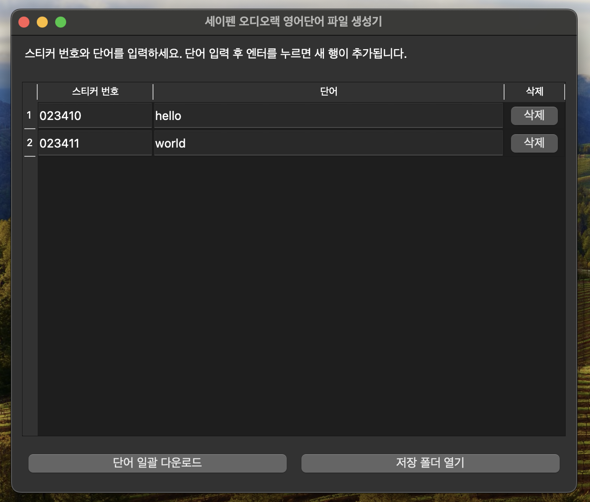

# 세이펜 오디오랙 영어단어 파일 생성기

세이펜 오디오 랙 스티커용 영어 단어 음원파일을 다운로드하는 스크립트.
다음 사전에서 단어를 검색한 후 단어 읽기 링크를 찾아서 다운로드한다.

개인적인 용도로 사용하기 위해 만들었으며, 상업적인 목적으로 사용하는 것은 금지합니다.

2024-03-10
김기수 <heisice@gmail.com>

## 스크린샷



## 기능

- 스티커 번호와 영어 단어를 입력하여 오디오 파일 생성
- 다음 사전에서 영어 단어 발음 자동 다운로드
- 생성된 파일을 세이펜 오디오랙 형식(REC1_번호.mp3)으로 저장

## 실행 파일 빌드 방법

### 1. 빌드 스크립트 사용 (가장 간단한 방법)

#### macOS / Linux:
```bash
# 실행 권한 부여
chmod +x build_mac_nuitka.sh
# 빌드 실행
./build_mac_nuitka.sh
```

#### Windows:
```
build_win_nuitka.bat
```

### 2. Makefile 사용

```bash
# macOS용 실행 파일 빌드
make mac

# Windows용 실행 파일 빌드
make win

# 현재 OS에 맞는 실행 파일 빌드
make
```

빌드가 완료되면 현재 디렉토리에 실행 파일이 생성됩니다:
- macOS/Linux: `saypen_words` 또는 `saypen_words.app`
- Windows: `saypen_words.exe`

## 실행 방법

### 1. 실행 파일 실행

#### macOS / Linux:
```bash
# 실행 권한 부여 (필요한 경우)
chmod +x saypen_words
# 실행
./saypen_words

# 또는 앱 번들 실행
open saypen_words.app
```

#### Windows:
```
saypen_words.exe
```

### 2. 원본 스크립트 실행

```bash
# Makefile 사용
make run

# 또는 직접 실행
python main.py  # Windows
python3 main.py  # macOS/Linux
```

## 필수 요구사항

- Python 3.7 이상
- pip
- PyQt5
- requests
- Nuitka (빌드 시 필요)
- imageio (아이콘 변환 시 필요)

## 사용 방법

1. 프로그램을 실행합니다.
2. 스티커 번호와 영어 단어를 입력합니다.
3. 단어 입력 후 엔터를 누르면 새 행이 추가됩니다.
4. 모든 단어를 입력한 후 '단어 일괄 다운로드' 버튼을 클릭합니다.
5. 다운로드가 완료되면 저장 위치가 표시됩니다.
6. '저장 폴더 열기' 버튼을 클릭하여 저장된 파일을 확인할 수 있습니다.

## 저장 위치

다운로드된 오디오 파일은 다음 경로에 저장됩니다:
- macOS: `~/Documents/세이펜_오디오/`
- Windows: `내 문서\세이펜_오디오\`

## Nuitka 빌드 도구 정보

Nuitka는 Python 코드를 C 코드로 변환한 후 컴파일하여 실행 파일을 생성하는 도구입니다.

### 장점
- 더 빠른 실행 속도: 컴파일된 C 코드로 실행되어 인터프리터 오버헤드가 없습니다.
- 더 작은 실행 파일: 필요한 모듈만 포함하여 실행 파일 크기를 최적화합니다.
- 코드 보호: 원본 Python 코드를 더 효과적으로 보호합니다.
- 메모리 사용량 감소: 최적화된 코드로 메모리 사용량이 감소합니다.

### 참고사항
- 빌드 시간이 다소 오래 걸릴 수 있습니다.
- 일부 복잡한 모듈이나 동적 코드 로딩에서는 추가 설정이 필요할 수 있습니다.
- PNG 아이콘 변환을 위해 imageio 패키지가 필요합니다.
